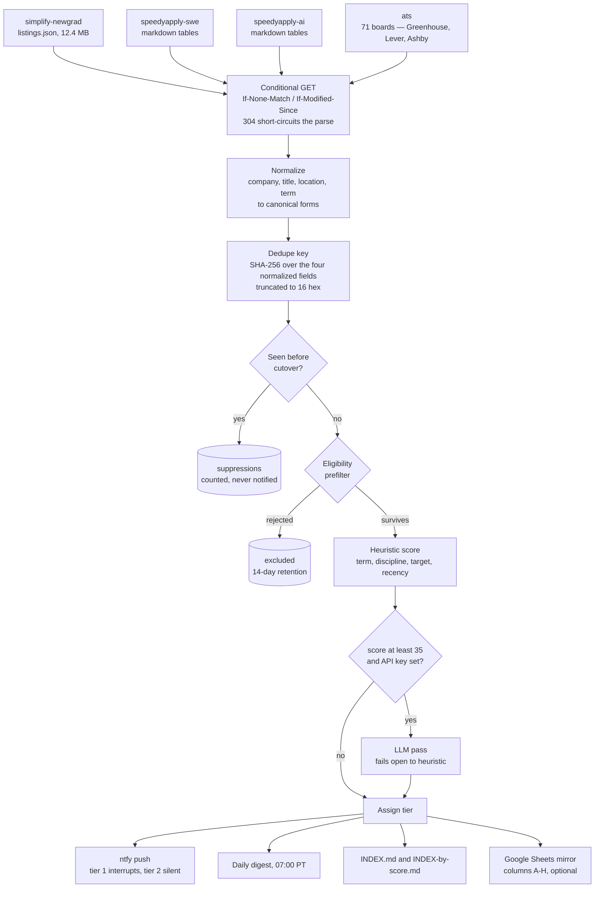

# jobpipe

Co-op and new-grad SWE/AI-ML postings are published across a handful of
community-maintained GitHub feeds and several hundred company ATS boards, none
of which agree on schema, none of which deduplicate against each other, and all
of which bury early-career reqs under senior listings. Being late to a posting
is the entire cost — the good ones close in days. `jobpipe` polls four feeds and
71 ATS boards on a cron, normalizes everything into one schema, collapses
duplicates across sources, drops what is structurally ineligible, scores what
survives, and pushes only the small remainder to a phone. It runs entirely on
GitHub Actions with SQLite as the store: no server, no always-on machine.

Current state: **3,139 postings** in the normalized store, **37 scheduled runs
per weekday**, **median 70s** per cycle, **675 tests**.

## Resume claims, verified

If you arrived from a resume, this is the claim-to-code map. Every figure below
was measured from this repository — the 360 committed run reports, the export,
or the test suite — and each links to the code that produces it.

| Claim | Where it lives |
|---|---|
| 3,100+ job postings from 4 external feeds and 71 ATS boards into a normalized store | `data/postings.jsonl` (3,139 rows); `companies.json` (71 boards, 68 live-verified); `sources/__init__.py` |
| normalized-key dedupe (SHA-256 over company/title/location/term) and an eligibility prefilter | `normalize.py:660-665`; `triage/prefilter.py` |
| median 70s per cycle, p90 111s, measured over 360 runs | `data/run-report.json` and its git history |
| 37 scheduled runs/weekday on GitHub Actions within a fixed CI minute budget, about half of them delivered | `.github/workflows/poll.yml:56-70` |
| conditional-request (ETag) caching, per feed and per ATS board | `sources/base.py:96-110`; `httpcache.py`; `sources/ats.py:192` |
| healthchecks and per-source volume alarms | `health.py`; `runner.py:347`, `runner.py:351` |
| corrected 14 of 89 misconfigured ATS board tokens via live probing, dropping 18 more as unreachable | `companies.json`; `cli.py:685` (`jobpipe verify-companies`) |
| hybrid scoring: deterministic rule filters plus an LLM pass over survivors, failing open to the rule score | `triage/scorer.py` |
| LLM calls gated behind a rule-score floor and cached permanently, so no posting is scored twice and the backlog is never scored at all | `scorer.py:59`, `scorer.py:356`, `scorer.py:386` |
| 675 tests, including injected-clock tests for time-dependent notification logic, and leak tests asserting no secret reaches the committed run report | `tests/`; `tests/test_notify_constraints.py` |

Two of these deserve their honest caveat up front rather than in an interview.
**The LLM pass has never run in production** — `ANTHROPIC_API_KEY` is
deliberately absent from the poll workflow, and across 360 recorded runs the
scorer reports 0 calls and 2,862 heuristic-only scores. And **37 is the
scheduled rate, not the delivered one**; GitHub drops scheduled fires under
load. Both are expanded below.

## Architecture



A cycle fetches roughly 13,300 raw rows and produces around 15 new stored
postings. Almost all of the reduction happens in the eligibility gate, before
anything is written.

## Data model

SQLite, one file, rebuilt from the committed JSONL export if lost. The tables
that carry design decisions rather than just rows:

| Table | Purpose |
|---|---|
| `postings` | The normalized store. Keeps `apply_url` and `source_url` separately because feeds frequently link a careers index rather than the req; `link_status` records what the URL actually resolved to. `dedupe_key` is `UNIQUE`. |
| `baseline` | Ids seen but deliberately not held as rows — id and timestamp only, ~30 bytes each. Answers "have I seen this" and nothing else. Baseline ids never notify and never enter an export. 2,422 rows. |
| `suppressions` | Every posting the baseline swallowed, keyed by `(baseline_id, title, source)` with a counter rather than appended per run. `COUNT(DISTINCT title)` per `baseline_id` is what makes over-collapse measurable: without it, a genuinely new posting that normalizes onto a baselined id is indistinguishable from a quiet day. |
| `excluded` | What the eligibility gate rejected, with `filter_reason` and `filter_version`, kept 14 days. The only evidence that a filter rule is wrong is exactly the data that rule discarded. |
| `sightings` | Per-posting absence tracking for expiry. Only runs where the source actually returned data are counted, so one flaky source cannot expire its entire catalogue. |
| `http_cache` | ETag / Last-Modified validators, persisted rather than in-memory because every Actions run is a fresh container. Carried between runs by `actions/cache`. |
| `score_cache` | Scores by posting id, never pruned. Re-scoring costs money and returns the same answer, so `--replay` can re-run tiering without re-billing a token. |

The database itself is gitignored. `data/postings.jsonl` and
`data/baseline.txt` are the committed source of truth — SQLite rewrites a
multi-megabyte blob for a one-row change, which is unworkable in a repo
committed every half hour.

## Scheduling and the CI budget

The schedule is the product of a fixed budget, not a latency target. Under a
private-repo allowance of 2,000 Actions minutes per month, cadence is the only
free variable, so it is spent where postings actually appear:

| Band | Cadence | Runs/weekday |
|---|---|--:|
| 09:00–13:00 PT | every 15 min | 16 |
| 06:00–09:00, 13:00–19:00 PT | every 30 min | 18 |
| 19:00 PT | once | 1 |
| 03:00, 23:00 PT | every 4 h | 2 |
| **Total** | | **37** |

Weekends run the 4-hour grid all day: 6 runs.

The 09:00–13:00 band is measured, not assumed — `jobpipe posting-hours`
re-derives it. It is computed from the ATS boards alone, because they are the
only source whose `posted_at` is a real publication instant; speedyapply
publishes an age rather than a timestamp, so its `posted_at` is stamped
relative to fetch time and 47 of its rows share a single minute:second. Using
all sources produces four sharp spikes that are purely that artifact.

Two things worth stating plainly:

- **GitHub does not deliver every scheduled run.** Measured delivery has run at
  roughly half the scheduled rate. The cadence above is what is requested, not
  what arrives.
- **The budget constraint is a private-repo constraint.** Public repositories
  get unlimited Actions minutes on standard runners, so the schedule that this
  design was shaped around is no longer binding for a public fork of it.

Cost control beyond cadence: conditional requests mean an unchanged feed costs
one request and no parse; the ETag database is carried between runs by
`actions/cache`; and the failure-path artifact upload is `if: failure()` only,
because uploading a multi-megabyte database on every green run is roughly 20
seconds of budget for something nobody opens.

## Scoring

Two stages, deterministic first.

**Eligibility** is a hard gate, not a score. It answers "is this even the right
kind of job" — non-engineering functions, senior levels, experience
requirements, wrong discipline. It is deliberately lenient: dropping a real
posting is invisible and unrecoverable, while keeping a junk one costs a row
and gets scored to tier 3 anyway. Rejections land in `excluded` with a reason
so the false-negative rate stays measurable.

**Heuristic scoring** assigns points for term, discipline, target-company
membership and recency. Tier follows from score:

```
any hard disqualifier                    -> tier 3
score >= 75 and target company           -> tier 1  (interrupting push)
score >= 60 and new-grad at a target     -> tier 1
score >= 55                              -> tier 2  (silent push)
otherwise                                -> tier 3  (digest only)
```

The second tier-1 path exists because the first is arithmetically unreachable
for new-grad roles: new-grad 32 + best-case discipline 22 + target company 20 =
74, one point short of 75, on the best combination that exists. The primary
category could never interrupt, whatever the company. Of 75 live tier-2
new-grad postings, exactly one was at a target company, so requiring target
membership — rather than lowering the score floor alone — is what bounds the
volume.

**The LLM pass** runs only on postings that clear a heuristic floor of 35, are
not already cached, and carry no hard disqualifier. Three properties are
load-bearing:

1. **Fail open.** A 429, a 5xx, a timeout, or an unparseable response never
   drops a posting. The deterministic score stands in, `tier_source` records
   that it did, and the notification goes out anyway. A posting silently lost
   to a rate limit is indistinguishable from a quiet day.
2. **Fallbacks are never cached**, so a transient outage cannot pin a posting
   to its heuristic score after the API recovers.
3. **The backlog never reaches the live path.** Scoring the cutover baseline
   would cost real money for rows that can never notify.

**In production the LLM has never run.** `ANTHROPIC_API_KEY` is deliberately
absent from the poll workflow, and across 360 recorded runs the scorer reports
0 calls, 0 fallbacks, and 2,862 heuristic-only scores. Every stored posting
carries `tier_source` of `heuristic` or `disqualified`. With a key configured,
77% of stored postings clear the floor of 35 and would be sent; the floor is a
cost lever, not a small one.

Delivery is constrained separately from scoring: quiet hours 22:00–06:00 PT
downgrade a tier-1 interrupt to silent rather than dropping it, interrupting
pushes are capped at 3/hour with overflow rolling into the digest rather than
queueing, and a downgraded push does not consume a cap slot.

## What went wrong

**89 seeded ATS board tokens, 35 of them not what was guessed.** Board tokens
were seeded from company names on the assumption that the slug matches. Probing
each one against the live API (`jobpipe verify-companies`) found 54 correct.
Fourteen more were recovered by testing slug and vendor variants — Cohere,
Snowflake, Notion and Confluent had migrated to Ashby; DoorDash is
`doordashusa`; Cursor is `cursor`, not `anysphere`. Eighteen were unreachable
under any variant and were removed, because a dead token costs a request every
run forever and can never return data. Three remain reachable but list no jobs.
The finding is that a guessed identifier fails silently in exactly the same way
as an empty board: both return zero rows, and only an explicit probe
distinguishes them. Token verification is now a command, not a one-off.

**Polling one minute before the data landed.** Simplify's `listings.json` never
returned 304, which initially looked like a broken cache. It was not: the
conditional request was wired correctly and the endpoint does serve ETags. The
upstream bot rewrites the file every 30 minutes, at :01 and :31 past the hour,
so there was genuinely nothing to 304. Checking that also surfaced a real bug —
the poll fired at :00 and :30, one minute *before* each publish, so anything
Simplify published waited a full cycle. Moved to :05 and :35. GitHub's
scheduler lag had been covering the gap by accident, which is precisely why it
was worth fixing: the punctual case is the one where latency should be best and
where a self-inflicted 29-minute delay costs the most. Same run count, same
budget. The general finding is that "our schedule" and "their schedule" are two
clocks, and aligning them is free.

**A related timezone variant of the same bug.** The digest cron was `0 7 * * *`
with a comment claiming 07:00 Pacific. Without an explicit `timezone` field
that is 07:00 UTC — midnight PT — so the daily roundup arrived while the phone
was face down. The digest commits nothing, so there was no artifact to notice
its absence; it now has its own healthcheck with a daily period, because a job
that produces no output needs an explicit liveness signal.

**Health is measured on fetch volume, not new-row count.** New rows cannot
distinguish a broken source from a quiet weekend — both are zero. Raw fetch
volume can: a healthy feed returns roughly the same number of postings whether
or not any are new. Each source is compared against a trailing median of its
own last 20 runs, warning below half or at zero, with 304 runs excluded from
the median because including them would drag the baseline toward zero and mask
exactly the collapse the check exists to catch.

## Running it locally

Requires Python 3.12 and `uv`.

```bash
make install
make test
```

675 tests, no network, about 5 seconds.

Copy the environment template and fill in what you need:

```bash
cp .env.example .env
```

Nothing in `.env` is required to run the pipeline. With no variables set it
fetches, normalizes, dedupes, filters, scores heuristically and writes the
export and indexes; notifications, the dead-man's switch, the LLM pass and the
Sheets mirror each stay inert rather than failing. See `.env.example` for what
each variable enables.

```bash
make dry-run     # full pipeline, no writes and no pushes
make run         # full pipeline
make stats       # database and configuration summary
make eval        # regenerate EVAL.md, plus exclusion and suppression samples
```

Useful for understanding the pipeline without running it:

```bash
# Show exactly how a posting normalizes and what key it dedupes on
python -m jobpipe.cli normalize \
  --company "Stripe, Inc." \
  --title "Software Engineer Intern, Fall 2026 (Co-op)" \
  --location "South San Francisco, CA"

# Probe every ATS board token against the live API
python -m jobpipe.cli verify-companies

# Re-derive the hourly posting distribution the poll band is based on
python -m jobpipe.cli posting-hours

# Sample what the eligibility gate rejected, to check for false negatives
python -m jobpipe.cli audit-exclusions --sample 20
```

Personal configuration lives in `profile/`. Copy
`profile/local.example.yml` to `profile/local.yml` for work-authorization and
term eligibility facts; it is gitignored. Without it the pipeline still runs and
the work-authorization disqualifiers simply stay inert.

`companies.json` is the coverage knob: add an entry with an ATS vendor and board
token, run `verify-companies`, and nothing else needs touching.

## Layout

```
src/jobpipe/
  sources/     one adapter per feed; conditional GET lives in base.py
  normalize.py company/title/location/term canonicalization and the dedupe key
  triage/      eligibility gate, discipline classifier, heuristic + LLM scorer
  store/       SQLite schema and migrations
  notify/      ntfy client and the quiet-hours / rate-cap constraint layer
  health.py    per-source volume and staleness alarms
  export.py    JSONL export and baseline file
  index_md.py  INDEX.md generation
  eval.py      EVAL.md generation from stored run reports
```

`ASSUMPTIONS.md` records every judgment call and the evidence behind it.
`docs/operations.md` covers setup, secrets and failure modes.
